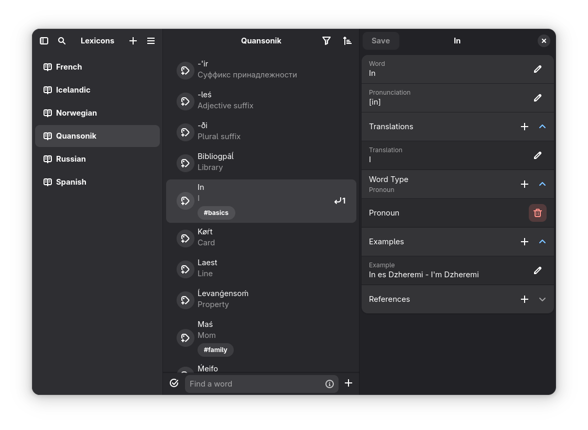
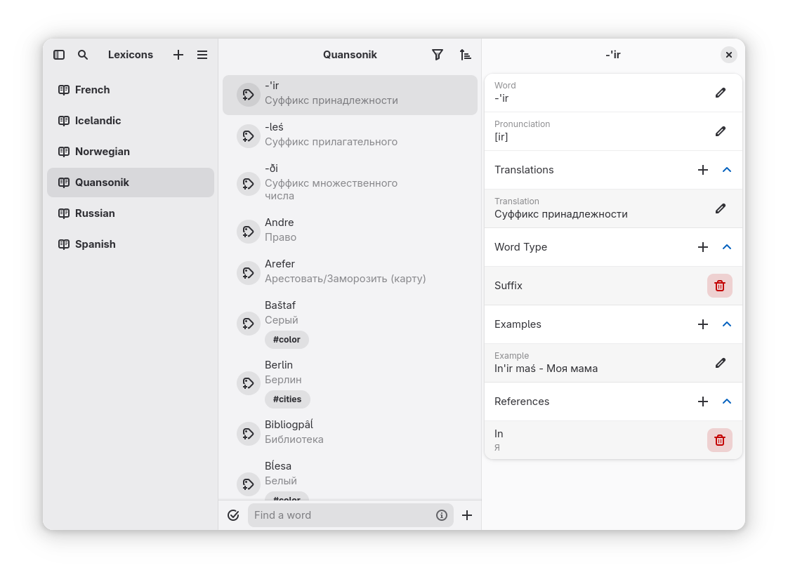
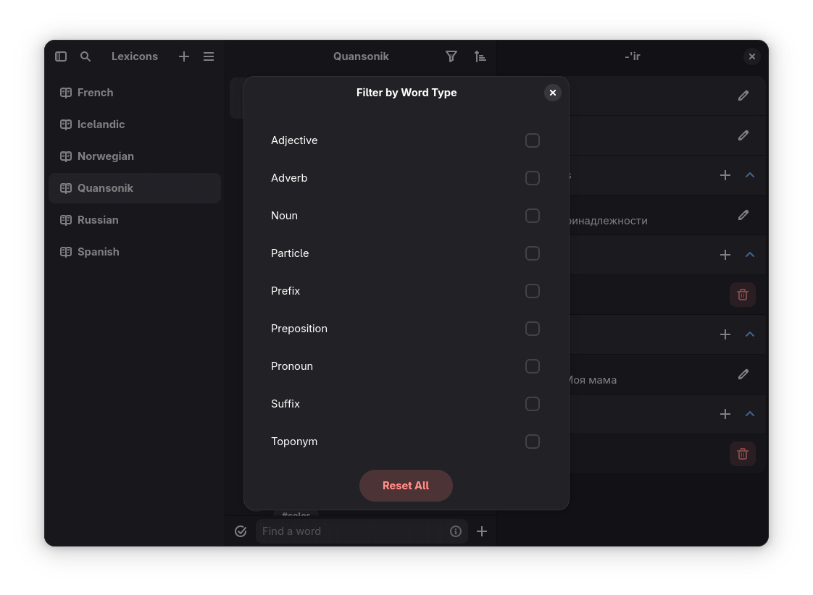
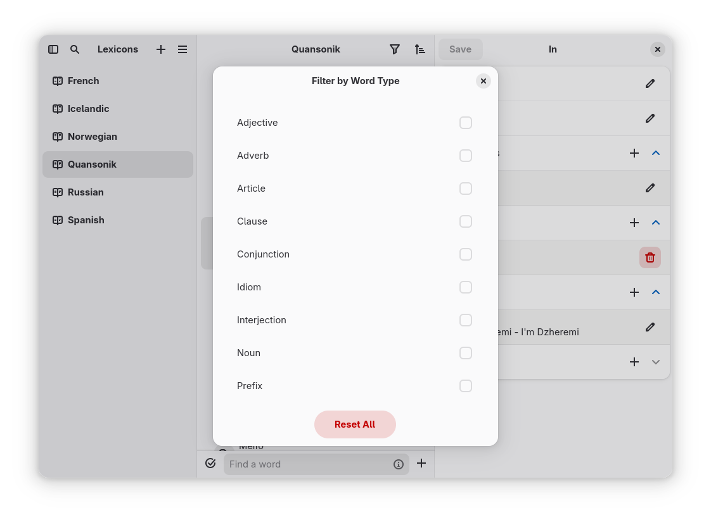
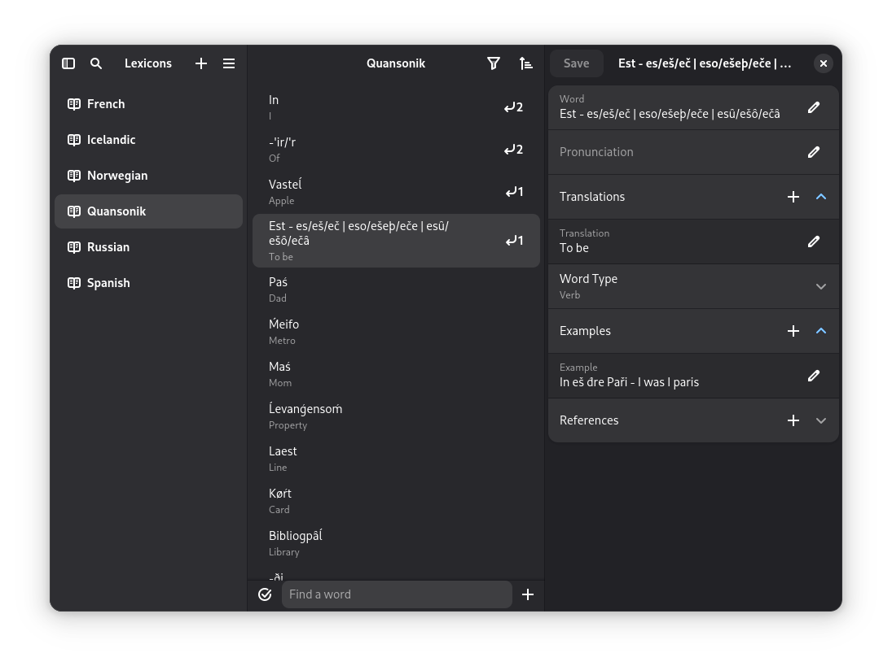
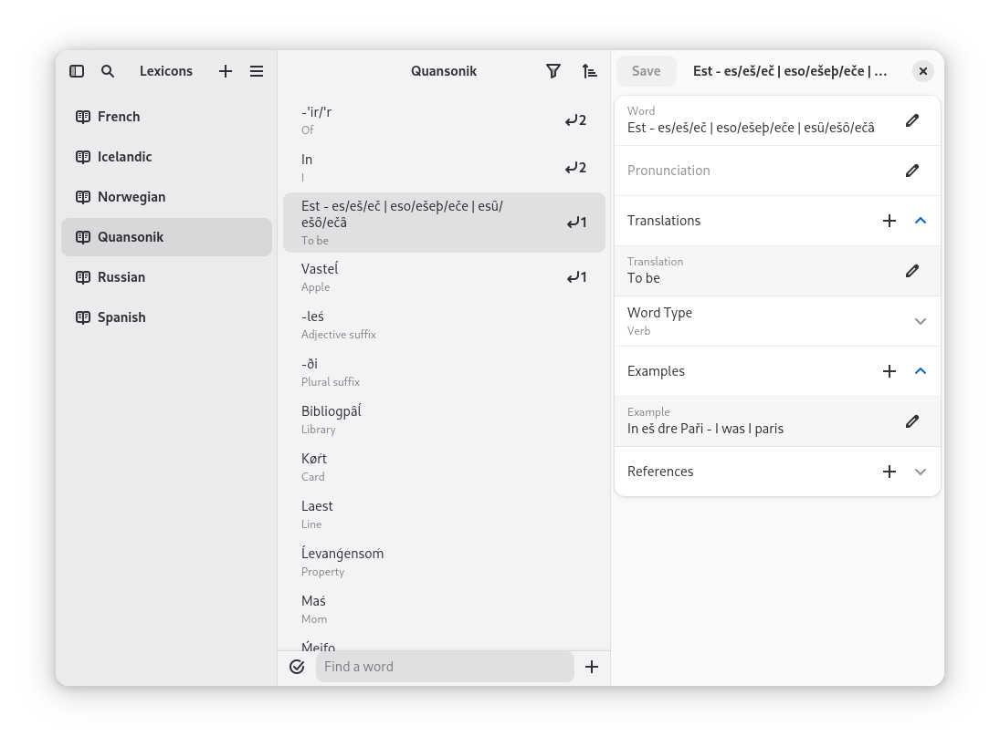
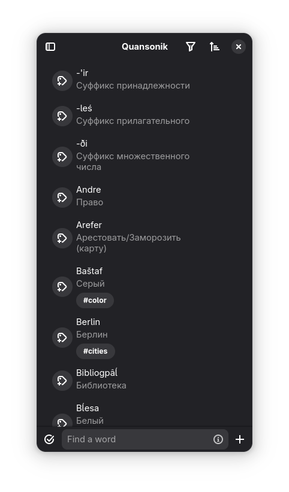

# Lexi
[flathub-url]: https://flathub.org/apps/io.github.dzheremi2.lexi
[installs-img]: https://img.shields.io/flathub/downloads/io.github.dzheremi2.lexi?style=for-the-badge&color=gree&logo=flathub

[![Installs][installs-img]][flathub-url]

### About Lexi
Lexi is a self-driven dictionary app for those who want to make their language learning (or creating) structured and easy.

You can give words:

<ul>
  <li>Word itself</li>
  <li>Pronunciation</li>
  <li>Multiple translations</li>
  <li>Word types e.g. Noun, Verb, Adjective e.t.c</li>
  <li>Multiple examples</li>
  <li>References to other words</li>
</ul>

### Installation

You can download app either on [Flathub](https://flathub.org/apps/io.github.dzheremi2.lexi) or by downloading and installing bundle from [latest release](https://github.com/Dzheremi2/lexi/releases/latest)

##### *Devel builds*

If you want to download a devel build, you can do it by downloading it from [Github Actions](https://github.com/Dzheremi2/Lexi/actions) from Artifacts section

>[!CAUTION]
>Devel builds may be unstable or don't even launch. Use it at your own risk

### Schedule
Lexi releases are published here and on [FlatHub](https://flathub.org/apps/io.github.dzheremi2.lexi) every Sunday (except for hotfixes). All pull requests must be merged by Friday 23:59 UTC+3; otherwise, they will be postponed until the following Friday.
Merging pull requests on Friday also initiates a string freeze — `.po` files are updated according to the changes made in the repository and are then ready for translation ahead of the Sunday release.

### Changelog
You can see full changelog for all versions [here](docs/CHANGELOG.md)

### Translation
You can help project to be internationalized using [Hosted Weblate](https://hosted.weblate.org/projects/lexi/lexi/)

##### Translation status

### Plans
You can see future plans on Projects page of this repo on [Lexi roadmap.](https://github.com/users/Dzheremi2/projects/3)

If you have an idea or you know a bug, please, open an [issue](https://github.com/Dzheremi2/Lexi/issues) with you idea/bug and it will be added to roadmap.

### Code of Conduct
The project follows the [GNOME Code of Conduct](https://conduct.gnome.org)

### Contributing
All contribution instructions are described in [CONTRIBUTING.md](https://github.com/Dzheremi2/Lexi/blob/master/CONTRIBUTING.md) file.

### Screenshots

